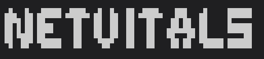

<div align="center">



[](https://github.com/BinaryAbyss-Studios/NetVitals/releases)
[](https://github.com/Binaryabyss-Studios/NetVitals-CLI/releases)
[](https://discord.gg/A2HGSGVhey)    
[](https://github.com/BinaryAbyss-Studios/NetVitals/commits/main)    
[](https://github.com/BinaryAbyss-Studios/NetVitals)

</div>

---

**Netvitals is a program that contains Tools about Networking and Cracking Wifi Hashes and Passwords Wirelessly.**

- **in this Tool you can Find Everyone Location Using his IP address (internet protocol) and every url information in the built in url lookup.**

- **you can find Forgotten Websites with Subdomain Enumerator Tool, and there is a bulit in Default Wordlist.**

- **Test Network Paaswords and Capture packets**

- **Arp Spoof Attacks/the Man in the Middle**

- **We Currently Supported 3 Offical OS  (Linux, Macos, Windows). & All Linux Distributions.**


# Installations

> **Disclamer**
>
> all executeable files in the releases down is the manual installations.

---

**Windows**

- Method 1
  Install the executable (exe) file and run it.

-  Method 2
  **run it directly from source (Manually)**
    
  ***powershell method***
```powershell
  git clone https://github.com/BinaryAbyssStudios/NetVitals-CLI.git
  cd NetVitals-CLI/
  py setup.py # do pip install -r requirements.txt for manual installation if you want.
  py src/main.py # EntryPoint
``` 

   ***Command prompt method***
``` bash
  git clone https://github.com/BinaryAbyssStudios/NetVitals-CLI.git
  cd NetVitals-CLI/
  py setup.py # do pip install -r requirements.txt for manual installation if you want.
  py src/main.py # EntryPoint
``` 

if your running it again after installation and run ( same directory (Same folder) )
``` bash
  cd NetVitals-CLI/
  .venv\Scripts\activate # if its powershell run ./.venv/Scripts/Activate.ps1
  py src/main.py # EntryPoint
``` 

---

**Linux** *(All Distros)* & **MacOS**

- Method 1
  Install Project Zip File using the terminal git clone **(Directly from source)**:
``` bash
  git clone https://github.com/BinaryAbyssStudios/NetVitals-CLI.gits
  cd NetVitals-CLI/
  python3 setup.py # do pip install -r requirements.txt for manual installation if you want.
  python3 src/main.py # EntryPoint
```

if you want to run after installation again (same directory): 
``` bash
  cd NetVitals-CLI/
  source .venv/bin/activate # Activate Virtual Enviroment # if fish terminal add .fish at the end (IF HAVE VIRTUAL ENVIROMENT)
  python3 src/main.py # EntryPoint
```

---

# buy us a coffee ☕

If you find this project useful, consider sponsoring its development.

[](https://github.com/sponsors/BinaryAbyssStudios)
